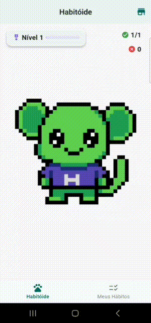
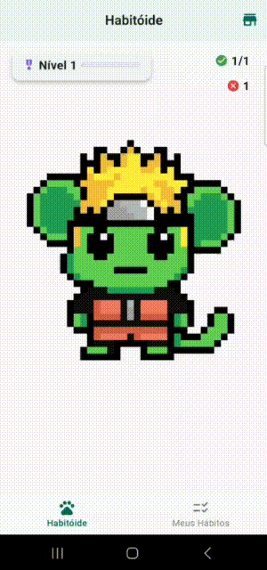
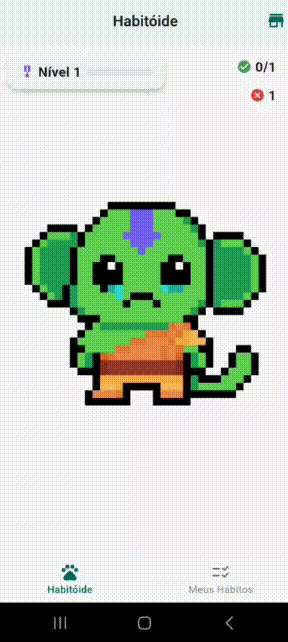
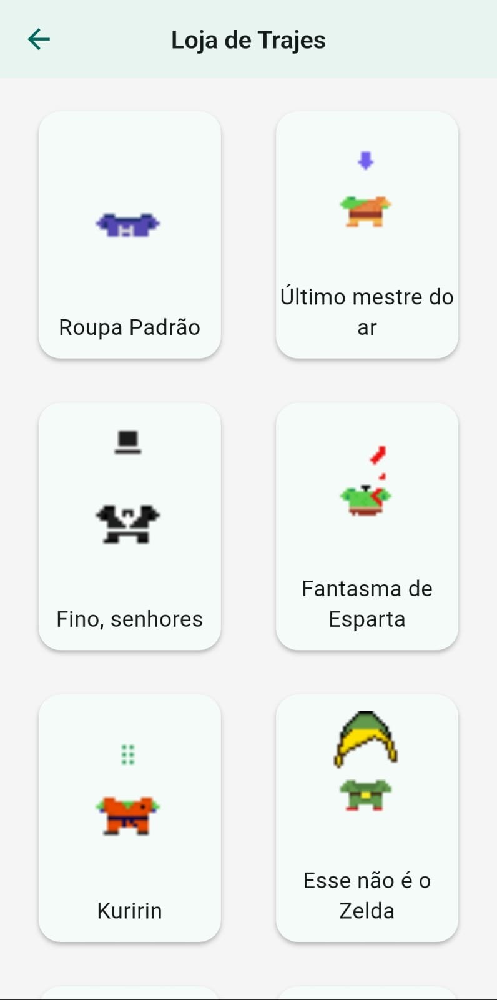
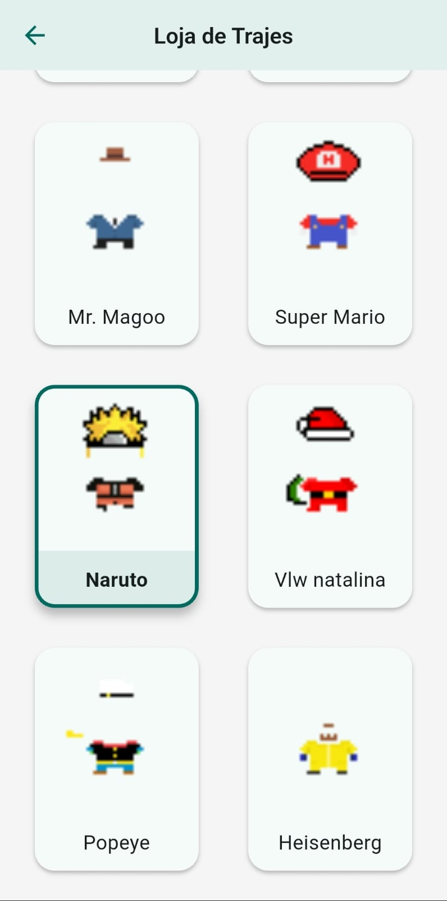
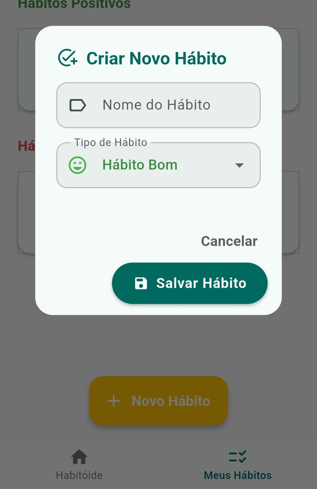
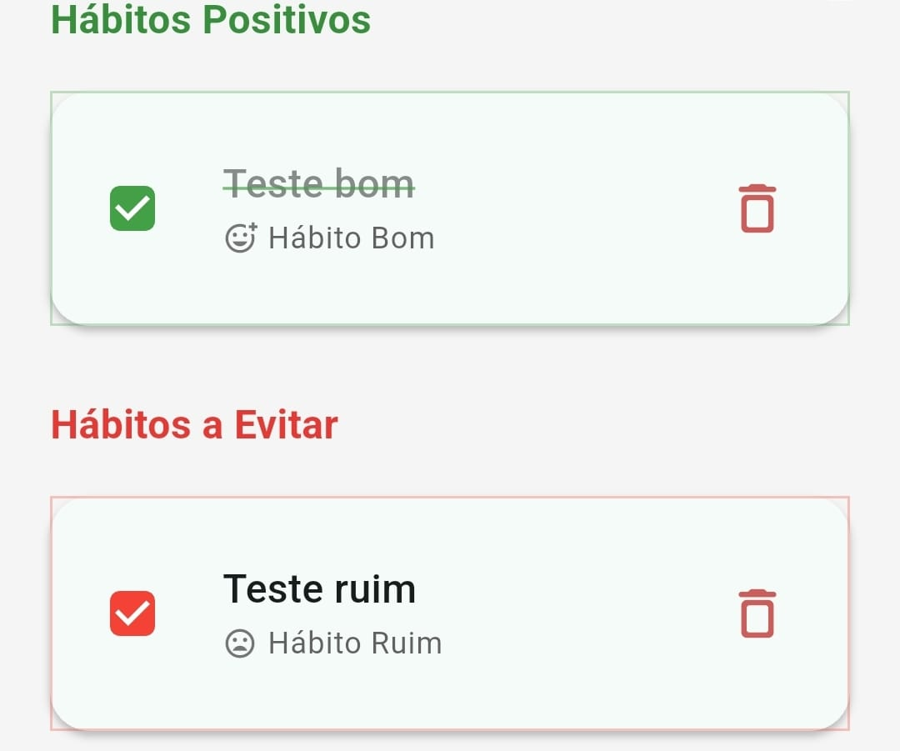
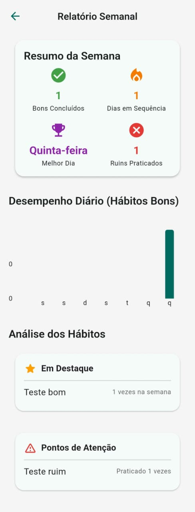

# Habitóide

Um aplicativo Flutter para rastreamento de hábitos, gamificado com um mascote interativo.

## Sobre o Projeto

Habitóide é um aplicativo de rastreamento de hábitos projetado para tornar a criação de rotinas mais divertida e engajadora. A principal característica é um mascote virtual cuja expressão e humor reagem diretamente ao seu progresso diário, criando um ciclo de feedback visual e motivacional.

  
  
  

### Funcionalidades

- **Criação de Hábitos:** Adicione "Hábitos Positivos" (que você quer construir) e "Hábitos a Evitar" (que você quer quebrar).
- **Acompanhamento Diário:** Marque facilmente seus hábitos como concluídos a cada dia.
- **Gamificação:** Ganhe pontos de experiência (XP) ao completar hábitos bons e suba de nível.
- **Mascote Interativo:** Um personagem central que reage ao seu desempenho (Feliz, Neutro ou Triste).
- **Loja de Trajes:** Personalize seu mascote com diferentes roupas.
- **Relatórios Semanais:** Visualize seu progresso com gráficos e estatísticas detalhadas.
- **Persistência de Dados:** Todo o seu progresso é salvo localmente no seu dispositivo.

### Telas do Aplicativo

<table>
  <tr>
    <td align="center"><strong>Loja de Trajes</strong></td>
    <td align="center"><strong>Mais Trajes</strong></td>
  </tr>
  <tr>
    <td></td>
    <td></td>
  </tr>
  <tr>
    <td align="center"><strong>Criação de Hábitos</strong></td>
    <td align="center"><strong>Lista de Hábitos</strong></td>
  </tr>
  <tr>
    <td></td>
    <td></td>
  </tr>
   <tr>
    <td align="center" colspan="2"><strong>Relatório Semanal</strong></td>
  </tr>
  <tr>
    <td align="center" colspan="2"></td>
  </tr>
</table>

### Tecnologias Utilizadas

- **Flutter & Dart**
- **Provider** para gerenciamento de estado.
- **Flame Engine** para o mascote interativo.
- **shared_preferences** para armazenamento local.
- **fl_chart** para gráficos de relatório.